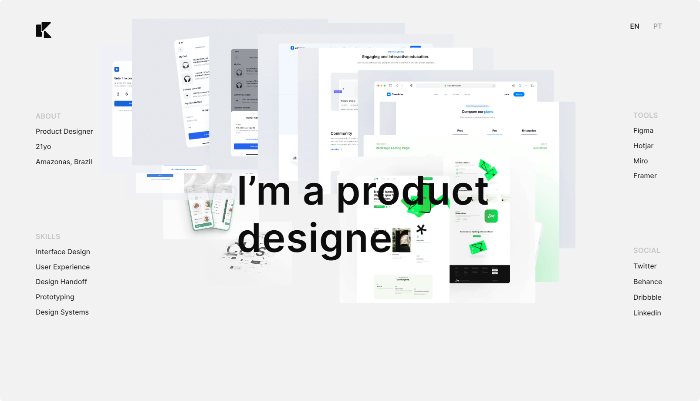

<h1 align="center">
    
</h1>

<div align="center">
    
    
</div>

<h1 align="center">
    
</h1>

<h3 align="center">You can access the project <a target="_blank" href="https://portfolio-animation-trail.netlify.app/" >Clicking here</a></h3>

---

</br>

# 🚀 Technologies

- [HTML](https://www.w3schools.com/html/)
- [CSS](https://www.w3schools.com/css/)
- [JavaScript](https://developer.mozilla.org/en-US/docs/Web/JavaScript)
- [GSAP](https://greensock.com/gsap/)
- [ImagesLoaded](https://imagesloaded.desandro.com/)

---

<br/>

## 🛠 How to download the project:

```bash
# Clone the repository
$ git@github.com:kennedybarros/personal-portfolio.git

# Enter directory
$ cd personal-portfolio
```

---

<br/>

</br>

# 💡 Credits

- [Codrops](https://github.com/codrops/ImageTrailEffects/)

---

<br/>

## 📝 Licença:

This project is under license. see the file [LICENSE](LICENSE.md) for more details.

<br/>

---

<br/>

<p align="center"> Developed by <a href="https://www.linkedin.com/in/kennedybarros/">Kennedy Barros</a> ✌🏼</p>
